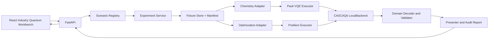

# 中科酷原行业量子实验台 - 生物医药领域架构设计

## 1. 架构结论

对外统一产品名称为“中科酷原行业量子实验台”。金融和生物医药作为产品内的一级领域，`CASCAQit` 仅表示底层量子编程 SDK 和执行引擎。

生物医药领域沿用金融 Demo 已验证的离线 FastAPI、React 工作台、CASCAQit 本地执行和审计报告结构，但不复用金融领域类型和命名。

四个场景分成两条执行链：

| 执行链 | 场景 | CASCAQit 入口 |
|---|---|---|
| Pauli/VQE | 小分子电子结构、金属活性中心有效模型 | `PauliHamiltonian`、`VQE`、`LocalBackend` |
| 组合优化 | 分子对接、小肽离散构象能景 | `QUBOProblemIR`、`QAOA` / `ProblemCompiler`、`LocalBackend` |

Pauli Hamiltonian 不是 QUBO。应用不能为了统一接口把电子结构问题改写成没有化学意义的 Ising 优化，也不能把分子对接的经典评分解释成电子能量。两条链在应用服务层共享输入签名、运行配置、结果摘要和审计记录，不在领域建模层强行合并。

本版本不修改 CASCAQit 的化学能力边界。分子积分、活性空间和费米子映射由离线化学适配器（Chemistry Adapter）或经过校验的固化实验数据（fixture）提供；CASCAQit 从 Pauli Hamiltonian 开始负责 VQE。真实硬件提交不在当前架构范围内。

## 2. 设计原则

### 2.1 领域事实与量子执行分开

- 领域模块负责解释分子、口袋、相互作用、自旋和构象；
- 适配器负责生成 Pauli Hamiltonian 或 QUBO，并保存来源；
- CASCAQit 负责验证、编译、优化、模拟和结果记录；
- 解码器使用原始领域输入复核结果；
- 前端只展示后端返回的结构化事实，不重新计算能量和约束。

### 2.2 经典计算边界公开

经典预处理、经典基线和量子执行分别保存：

```text
source data
  -> classical preprocessing fixture
  -> domain model
  -> Pauli Hamiltonian / QUBO
  -> CASCAQit execution
  -> quantum candidate
  -> domain validation
  -> classic comparison
```

经典预处理可以生成轨道积分、候选构象和离散能景，但不得预先写入量子采样结果。经典基线用于校验和比较，不参与量子候选成功率，也不在采样失败时替换量子结果。

### 2.3 模式由结构决定

- Digital VQE：通用 Pauli Hamiltonian、非对角 `X/Y` 项、QWC 测量；
- Digital QAOA：稠密、全局、方向或带辅助变量的组合约束；
- Hybrid QAOA：完整局域冲突组可由 Rydberg interaction 表达，同时存在真实 Digital residual；
- Analog QAA：完整 Hamiltonian 可由目标和布局表达，不存在隐藏数字项。

默认模式来自编译可行性和领域门禁。编译成功不等于领域适合，原子布局也不能只为得到 Hybrid 图形而删除或补充业务边。

## 3. 总体结构



## 4. 代码布局

生物医药领域代码使用独立包，避免继续扩大金融领域模型的职责。第一阶段采用统一行业 API 外壳，领域目录、路由和缓存签名显式携带 `domain_id`；金融兼容 API 保留在原包内：

```text
src/
  cascaqit_biomedicine_demo/
    catalog.py
    active_center.py
    docking.py
    electronic_structure.py
    fixtures.py
    pauli_vqe.py
    peptide_landscape.py
    problem_model.py
    data/
      docking_match/
      electronic_structure/
      active_center/
      peptide_landscape/
  cascaqit_industry_demo/
    problem_api.py             # 领域中性的 Problem 执行协议
    problem_executor.py        # QAOA / Hybrid 编译、优化和解码编排
  cascaqit_finance_demo/
    api/app.py                 # 统一行业 API 外壳与金融兼容入口
    quantum/problem_executor.py # 对中性执行器的金融兼容重导出
    static/                    # 统一 React 生产构建
```

`cascaqit_finance_demo` 在生物医药建设期间保持可运行，不直接重命名已有 `FinanceProblemDefinition`、`FinanceModeAdvisor` 或旧 API。生物医药的 fixture、QUBO builder、贡献账本、TermGroup、GeometryEvidence、ProblemDefinition 和解码结果均为独立类型，不依赖 `Finance*` 领域类型。

第三阶段已提取不依赖金融类型的 `pauli_vqe.py`，由电子结构与金属活性中心共同复用 Hamiltonian 构造、稳定哈希、精确对角化和自旋扇区聚合。金属活性中心没有继续扩展金融执行器依赖。

小肽场景直接使用 CASCAQit `QAOA`、生物医药自有 `OptimizationProblemDefinition` 和贡献账本。构象匹配使用 `cascaqit_industry_demo.problem_executor.ScenarioExecutor` 获取 Digital/Hybrid 编译与执行证据；该包只依赖领域中性 Protocol 和 dataclass，不导入金融包。原金融 `problem_executor.py` 保留兼容重导出，使既有金融 API 与测试继续使用 `FinanceAlgorithmPolicy`、`FinanceModeAdvisor` 和 `ScenarioExecutor` 名称，但真实实现只有一份。架构测试阻止生物医药包重新引用 `cascaqit_finance_demo`。

前端沿用当前 `frontend/` 工程和构建方式，统一展示“中科酷原行业量子实验台”品牌，并增加金融/生物医药领域切换、领域场景目录和领域视图。生产构建继续复制到现有 `cascaqit_finance_demo/static/`，由统一 FastAPI 应用托管。Python 项目新增 `cascaqit-industry-api` 和 `cascaqit-industry-demo` 入口，金融入口继续保留以兼容已有部署。

## 5. 公共领域接口

四个场景实现统一的应用接口，但返回各自的领域结果：

```python
class BiomedicineScenario(Protocol):
    case_id: str
    title: str
    execution_family: Literal["pauli_vqe", "problem"]

    def default_input(self) -> Any: ...
    def validate(self, case_input: Any) -> tuple[DomainIssue, ...]: ...
    def analyze(self, case_input: Any) -> ScenarioDefinition: ...
    def decode(self, case_input: Any, execution: Any) -> Any: ...
    def classic_reference(self, case_input: Any) -> Any: ...
```

`ScenarioDefinition` 是应用层联合类型：

```python
from typing import Union

ScenarioDefinition = Union[
    PauliExperimentDefinition,
    OptimizationProblemDefinition,
]
```

### 5.1 PauliExperimentDefinition

用于电子结构和有效自旋模型：

```text
case_id
dataset_id / manifest_hash
hamiltonian: PauliHamiltonian
logical_order
initial_state
ansatz_definition
observable_definitions
reference_energy
reference_method
metadata
```

### 5.2 OptimizationProblemDefinition

用于分子对接和小肽能景：

```text
case_id
dataset_id / manifest_hash
problem: QUBOProblemIR
business_variables
auxiliary_variables
term_groups
coefficient_contributions
analog_candidate_group_ids
geometry_evidence
metadata
```

该结构沿用金融 Demo 的系数账本和模式证据思想，但名称、字段说明和诊断码使用领域中性或生物医药语义，不依赖 `Finance*` 类型。

## 6. 数据与固化实验数据

### 6.1 目录规则

每个预设使用一个版本目录：

```text
data/<scenario>/<dataset>/<version>/
  manifest.json
  domain.json
  pauli.json          # Pauli 场景
  qubo-input.json     # QUBO 场景
  reference.json
  preview.png
```

原始 PDB、SDF 或量子化学输出只有在许可证允许且发布确有需要时进入 Python 包。默认优先保存经过复核的最小派生数据和来源 checksum，避免让运行包携带无法解释的大型原始文件。

### 6.2 manifest

```json
{
  "dataset_id": "electronic.h2.bond-scan",
  "version": "1",
  "source": {
    "kind": "generated",
    "uri": null,
    "license": "project_generated"
  },
  "generation": {
    "tool": "pyscf",
    "tool_version": "to_be_pinned",
    "script_hash": "...",
    "parameters": {}
  },
  "units": {},
  "logical_order": [],
  "artifacts": [],
  "reference": {},
  "limitations": []
}
```

加载器验证数据结构、checksum、逻辑顺序、单位和交叉引用。任一数据不一致都必须在分析前失败，不允许后端用部分数据继续执行。

### 6.3 fixture 生成

生成脚本与运行时分离：

- 生成环境可以使用 PySCF、OpenFermion、RDKit 或其他经典工具；
- 运行时默认不依赖这些大型工具；
- 脚本输出经过 schema 校验和参考计算后才进入仓库；
- CI 读取 fixture 做一致性检查，不要求重新生成所有化学数据；
- 发布前在受控环境执行一次可重复生成审计。

## 7. Pauli/VQE 执行链

### 7.1 分析

`PauliVQEExecutor.analyze()` 完成：

1. 校验 fixture 和领域输入；
2. 构造或选择 `PauliHamiltonian`；
3. 校验 logical order、初态和 Ansatz 参数数量；
4. 生成 QWC 测量计划和资源估算；
5. 计算输入、Hamiltonian、Ansatz 和分析 hash；
6. 返回经典参考摘要，但不执行优化。

### 7.2 执行

```text
PauliHamiltonian
  -> VQE(operator, ansatz, layers)
  -> exact or sampled objective
  -> SPSA / Adam / accepted deterministic optimizer
  -> optional candidate confirmation
  -> final sampling
  -> observables
  -> domain result
```

电子结构和有效自旋模型可以使用不同初态、Ansatz 和观测量，但共用执行、测量和审计实现。

### 7.3 结果

`PauliRunResult` 至少保存：

- 最低评估、最终优化点和末端采样的区别；
- 每次目标评估和参数；
- 测量组、shots、方差和标准误；
- 理想或噪声执行事实；
- 能量和声明观测量；
- 经典参考及误差；
- Hamiltonian、Ansatz、Backend 和结果 hash。

## 8. 组合优化执行链

### 8.1 分析

`BiomedProblemExecutor.analyze()` 完成：

1. 校验领域输入；
2. 构造 QUBO 和逐系数贡献账本；
3. 调用 `ProblemCompiler.analyze()`；
4. 检查编译可行性；
5. 检查 Analog core 完整性和几何保真；
6. 给出 Digital、Hybrid、Analog 的结构化判断。

### 8.2 执行

构象匹配需要 Hybrid 编译证据，通过领域适配器进入 `ProblemCompiler` 和现有场景执行器：

```text
QUBOProblemIR
  -> ProblemCompiler.compile(mode, algorithm, target)
  -> QAOA / Hybrid D-A-D QAOA
  -> parameter optimization
  -> final sampling
  -> candidate decoding
  -> original-domain validation
  -> bounded classic comparison
```

小肽场景只开放 Digital QAOA，不需要构造 Analog core 或 Hybrid residual，直接把领域中性 `QUBOProblemIR` 交给 CASCAQit `QAOA`：

```text
QUBOProblemIR
  -> CASCAQit QAOA
  -> parameter optimization
  -> final sampling
  -> one-hot feasible candidate decoding
  -> complete finite classic landscape comparison
```

### 8.3 系数账本

每个 QUBO 贡献包含：

```text
contribution_id
group_id
source_rule
targets
coefficient
role
term_kind
```

应用检查领域贡献之和等于 Canonical QUBO 系数，并在编译后检查 Analog 与 Digital 系数之和等于逻辑 Hamiltonian 系数。对接场景的每条 Analog 二体项必须对应空间碰撞或占位冲突。

## 9. 四场景映射

| 场景 | 领域输入 | IR / Hamiltonian | 默认算法 | 经典对照 |
|---|---|---|---|---|
| 小分子电子结构 | 几何、活性空间、Pauli fixture | `PauliHamiltonian` | Digital VQE | 精确对角化、HF |
| 分子对接 | 构象、口袋特征、匹配和冲突 | `QUBOProblemIR` | Hybrid QAOA | 有界枚举、共晶参考 |
| 金属活性中心 | 交换耦合、局域场、有效模型 | `PauliHamiltonian` | Digital VQE | 精确对角化 |
| 小肽能景 | 序列、离散构象、接触能 | `QUBOProblemIR` | Digital QAOA | 完整离散能景 |

## 10. API

统一行业应用使用领域化请求路径，同时保留旧金融路径：

```text
GET  /api/health
GET  /api/domains
GET  /api/domains/{domain_id}/scenarios
POST /api/domains/{domain_id}/scenarios/{case_id}/analyze
POST /api/domains/{domain_id}/scenarios/{case_id}/run

# 金融兼容入口
GET  /api/scenarios
POST /api/scenarios/{case_id}/analyze
POST /api/scenarios/{case_id}/run
```

第一阶段尚未开放独立 dataset manifest HTTP 接口；manifest 通过分析和审计响应返回必要摘要，完整文件随 Python 包安装。

### 10.1 分析请求

```json
{
  "preset": "reference",
  "values": {}
}
```

### 10.2 运行请求

```json
{
  "preset": "reference",
  "values": {},
  "mode": "recommended",
  "algorithm": "recommended",
  "layers": 1,
  "shots": 64,
  "seed": 23,
  "optimizer": {
    "method": "recommended",
    "budget": 12,
    "starts": 1
  }
}
```

API 对不适用组合返回 422 和结构化诊断。例如 Pauli/VQE 场景请求 `hybrid`、对接场景请求 `vqe`、缺失 fixture 或 checksum 不一致都必须在执行前失败。

### 10.3 响应外层

```text
scenario
dataset
analysis
run
  domain
  quantum
  comparison
  audit
```

`domain` 根据场景使用联合类型；`quantum` 根据 VQE、Digital QAOA 或 Hybrid QAOA 使用可辨识联合类型。前端按 `kind` 渲染，不通过字段是否存在猜测响应类型。

## 11. 前端

### 11.1 场景组件

```text
ElectronicStructureView
DockingView
ActiveCenterView
PeptideLandscapeView
```

金融与生物医药共用品牌头、领域切换、场景导航、参数控制和结果工作区。金融域保持五个既有结果标签；生物医药域显示领域结果、场景结构、Problem 映射、量子实验、对照分析和审计证据六个标签。对照分析是独立视图，按场景分别展示量子观测、精确对角化、经典全枚举或共晶派生参考，不能用领域结果页中的摘要代替。

公共组件包括执行参数、模式判断、线路、原子布局、波形、测量分组、参数历史、counts、审计载荷和错误状态。品牌头常驻显示 `LOCAL SIMULATION`、`NO HARDWARE EXECUTION` 和 `RESEARCH DEMONSTRATION`；专业缩写首次出现时使用中文 tooltip 解释。

### 11.2 可视化来源

- 分子和口袋图读取后端提供的稳定节点、键、坐标和标签；
- 前端可以做投影、缩放和布局，但不能改变领域关系；
- 量子线路、原子位置、interaction、波形和 counts 全部来自 CASCAQit 执行上下文；
- 预览图属于数据资产，必须在 manifest 中登记；
- 后续若引入 3D，使用独立的结构查看组件，不把量子原子阵列与分子三维坐标混为一图。

### 11.3 状态隔离

运行缓存签名包含：

```text
case_id
dataset_version / manifest_hash
domain_input_hash
execution_family
mode / algorithm / ansatz
layers / shots / seed
optimizer config
noise config
```

任一字段变化后，旧结果只能作为历史记录显示，不能进入当前结果视图。

当前前端签名直接序列化 `domain_id`、`case_id`、完整运行请求，以及分析响应中的 `dataset.version`、`dataset.manifestHash` 和 `executionFamily`。领域输入、模式、算法、层数、shots、seed、优化器和噪声参数均属于完整运行请求。manifest 或执行族变化会立即使旧缓存失效。

## 12. 审计与安全

### 12.1 hash 链

```text
source checksum
  -> manifest hash
  -> domain input hash
  -> Hamiltonian / Problem hash
  -> analysis hash
  -> compile / Ansatz hash
  -> Backend Job / result hash
  -> report hash
```

### 12.2 输入边界

- 首期 API 只允许目录中已登记的数据集；
- 不接受浏览器上传任意 Python、Hamiltonian 表达式或可执行脚本；
- 数值输入检查范围、有限性和单位；
- 报告文件名由后端生成，不使用用户输入拼接路径；
- 报告写入配置的用户数据目录，API 返回 `reportPath`，不写入安装目录；
- 错误响应不返回本机绝对路径或完整异常栈。

### 12.3 数据边界

- 不保存患者或临床个体数据；
- 不将公开数据库访问凭据写入 fixture；
- 来源和许可证未确认的数据不进入发布包；
- 合成数据在页面和 manifest 中明确标记。

## 13. 测试策略

### 13.1 数据测试

- manifest schema 和 checksum；
- 单位、逻辑顺序和交叉引用；
- Pauli 项 Hermitian 与变量唯一性；
- 构象、碰撞、接触和参考结果一致性；
- fixture 可重复生成审计。

### 13.2 领域测试

- 输入正向、负向和边界；
- QUBO 系数和贡献账本守恒；
- 电子结构参考能量；
- 自旋模型参考关联；
- 对接冲突和构象一致性；
- 小肽构象去重、自回避和能量。

### 13.3 执行测试

- Pauli VQE 完成真实目标评估、测量和末端采样；
- QAOA 完成编译、优化、counts 和领域解码；
- Hybrid 的 Analog core、Digital residual、D-A-D block 和系数守恒；
- 固定 seed 可重复性；
- 量子候选与经典对照严格分离；
- 报告生成不触发二次执行。

### 13.4 API 和前端测试

- 四场景目录和预设数量；
- 不适用模式和损坏 fixture 的 422；
- 前端四个核心用户流程；
- 中英文领域术语；
- 运行缓存签名；
- `1440 x 900`、`1280 x 720`、`390 x 844` 截图；
- canvas/SVG 非空、无重叠和无页面级横向溢出。

## 14. 可观测性和失败处理

每次分析和执行记录：

- `case_id`、`dataset_id` 和 `error_id`；
- API 层 `preflight`、领域执行、报告生成和总耗时；算法内部通过目标评估数、Backend 执行数、shots、参数历史和测量组保留可观测证据；
- 逻辑量子位、Pauli 项、测量组、QUBO 项和辅助变量数量；
- Backend 执行次数、shots 和模拟方法；
- 失败阶段和稳定诊断码。

领域数据错误返回 422；未支持能力返回 CASCAQit `CapabilityError` 的结构化信息；未知内部错误返回 500 和 `error_id`，详细异常只写入本地日志。

四个推荐配置在场景目录中保存基于固定 seed 校准的本机耗时基线。前端按 shots、预算、优化起点、重复次数和层数估算当前研究配置；估算超过 30 秒时在执行按钮前显示提示。该数字只用于本地等待量级，不是硬件或跨平台性能承诺。

## 15. 分阶段实施

### 第一阶段：公共骨架和 Pauli VQE

- 新建生物医药包、API、目录和 manifest 加载器；
- 定义应用层联合结果结构；
- 完成 H2 fixture、Pauli VQE 执行和经典对照；
- 建立审计 hash 链。

### 第二阶段：分子对接旗舰场景

- 完成离线结构派生数据；
- 构造 QUBO、系数账本和领域解码；
- 完成 Hybrid 几何门禁；
- 完成相互作用网络和量子实验页面。

### 第三阶段：有效自旋模型

- 复用 Pauli VQE 链接入有效自旋模型；
- 后端返回局域磁化、两点关联和声明扇区占据；
- 使用相同 Hamiltonian hash 完成精确对角化对照。

### 第四阶段：小肽能景

- 使用生物医药自有 QUBO 契约直接接入 CASCAQit QAOA；
- 构造离散小肽能景和 Digital QAOA；
- 完成四场景统一导航、结果和审计体验。

### 第五阶段：校准和发布

- 标准预设固定 seed 校准；
- 全量质量门禁和浏览器验收；
- 离线包和启动脚本；
- 客户讲解文档、数据来源清单和已知限制。

### 第六阶段：设计完成度收口

- 提取领域中性 Problem 执行器并保留金融兼容层；
- 增加常驻运行边界和独立对照分析视图；
- 补齐数据集与执行族缓存身份、研究配置成本提示；
- 统一结构化错误、用户目录报告和 API 阶段耗时；
- 逐条复核 PRD、架构、浏览器、wheel 和离线包构建证据。

## 16. 关键风险

| 风险 | 影响 | 处理 |
|---|---|---|
| 化学 fixture 来源不完整 | 无法解释 Hamiltonian | manifest、checksum、生成脚本和经典参考同时入库 |
| 把离散匹配说成完整对接 | 客户形成错误预期 | 产品命名、结果字段和限制统一使用“候选构象匹配” |
| 有效模型被误解为真实金属酶 | 科学可信度受损 | 页面固定显示模型层级、来源和省略项 |
| 小肽构象库使问题过于简单 | 演示价值有限 | 展示完整能景和采样行为，不声明计算优势 |
| Hybrid 几何产生补边 | 业务映射失真 | 完整 interaction 图门禁，失败时降为 Digital |
| VQE 有低能但末端采样不稳定 | 结果解释混乱 | 分开显示能量估计、参数选择和末端采样 |
| 四场景同时开发扩大范围 | 延迟发布 | 按执行链分阶段，共用骨架但逐场景通过发布条件 |

## 17. 架构验收

架构实现完成时应满足：

- Pauli/VQE 与 QUBO/Problem 两条执行链边界清楚；
- 四个领域模块不依赖 React 或 FastAPI；
- fixture 可以独立验证，运行时不需要化学工具或网络；
- 前端不生成量子事实；
- 所有推荐模式来自编译和领域门禁；
- 经典参考不能替换量子候选；
- 现有金融 Demo 在生物医药开发期间仍可运行和回归；
- 文档、API、测试和页面使用一致的场景名称与限制。
