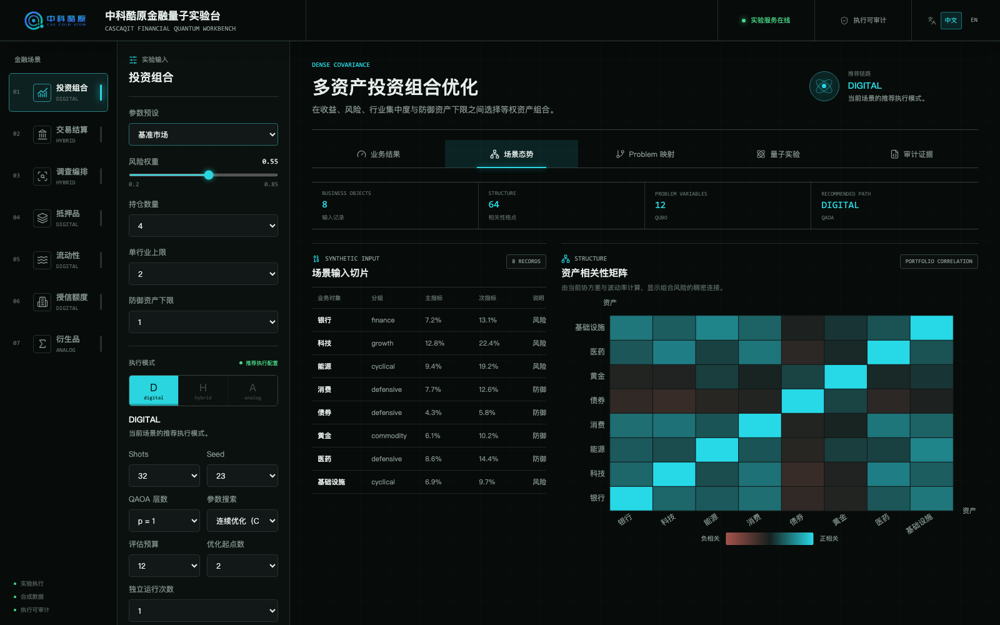
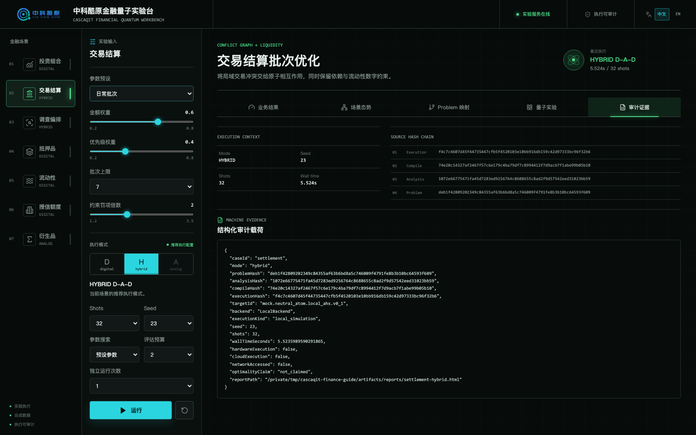
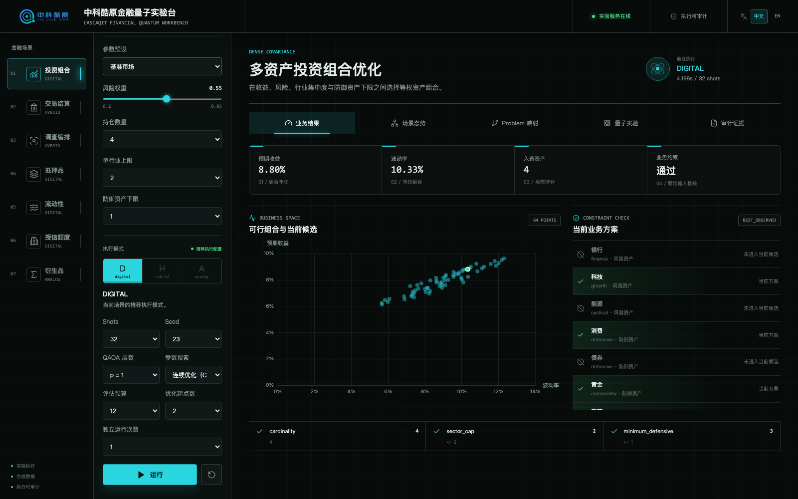
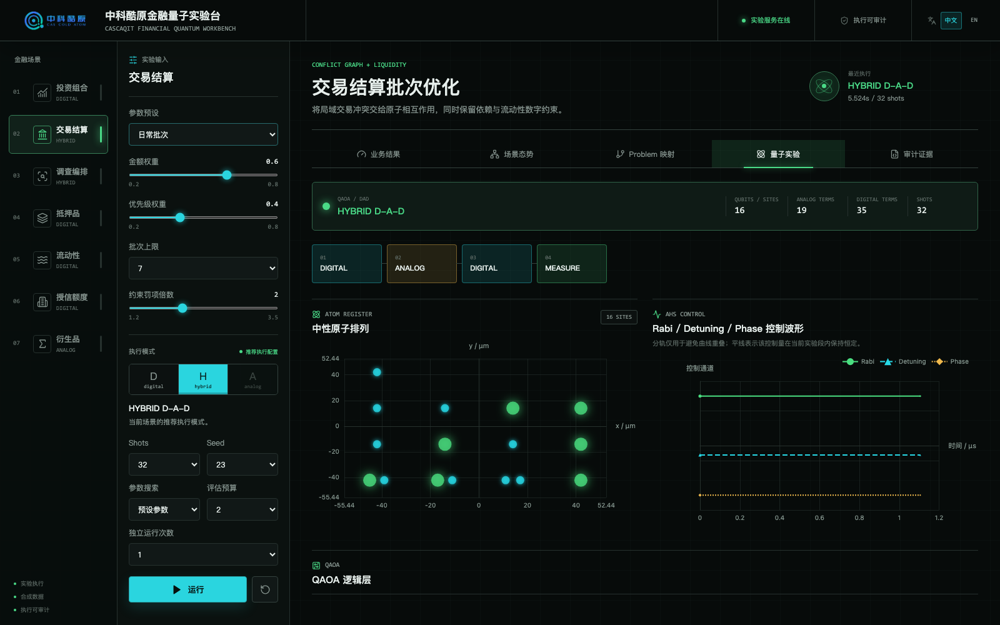
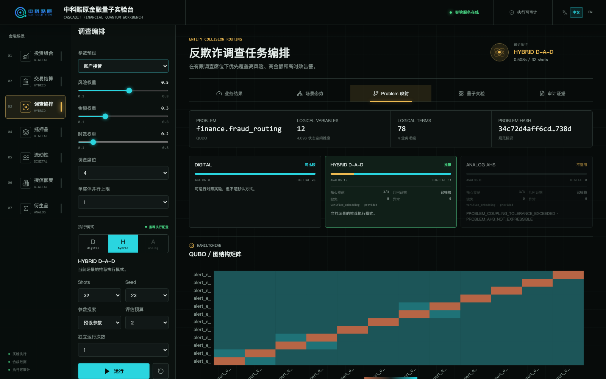
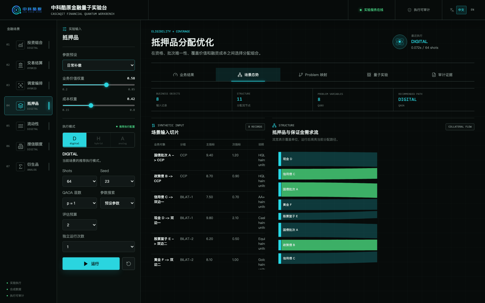
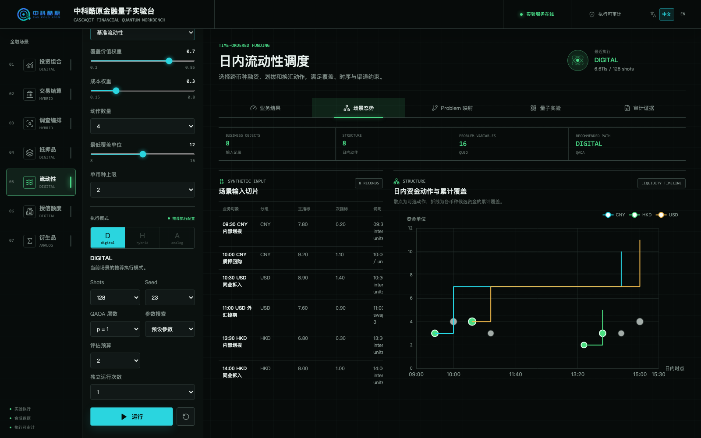
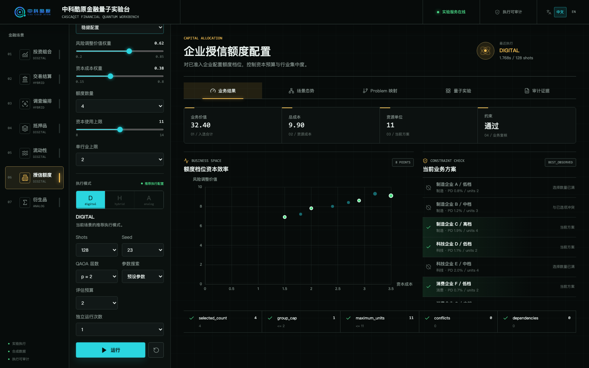
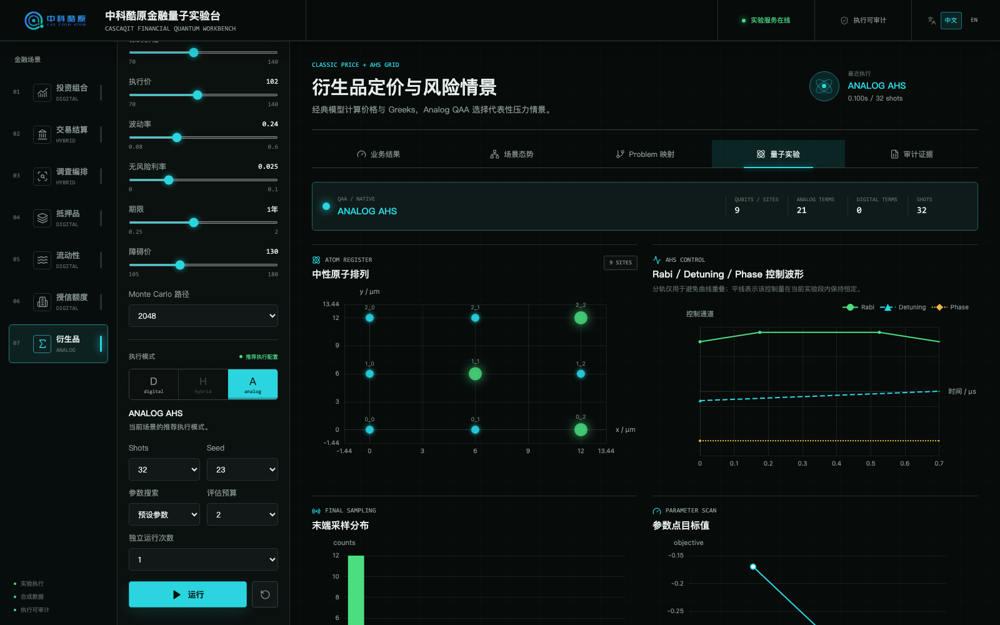

# 中科酷原行业量子实验台：金融场景讲解与页面解读

本文以当前发布代码为准，供讲解人员在不了解金融工程或量子算法细节时快速查阅。内容回答五个问题：场景解决什么业务问题、接收什么输入、返回什么结果、怎样建模和选择算法，以及页面上每个主要元素应该怎样解释。

这套系统当前运行 CASCAQit `LocalBackend` 本地数值模拟。页面展示的是实际生成和执行的 Digital、Hybrid 或 Analog 程序结果，但不是量子真机结果，也不能据此声称量子加速、量子优势或生产最优性。

## 一次运行经过哪些步骤

```text
业务预设和参数
  -> 输入校验
  -> FinanceProblemDefinition
  -> QUBO / MWIS Problem IR
  -> ProblemCompiler 分析三种执行模式
  -> FinanceModeAdvisor 判断业务适配性
  -> Digital QAOA / Hybrid D-A-D QAOA / Analog QAA
  -> 参数搜索和末端采样
  -> 位串解码
  -> 按原始业务规则重新检查约束
  -> 业务结果、场景态势、Problem 映射、量子实验和审计证据
```

六个组合优化场景使用二元变量：`1` 表示选择某项资产、交易、告警或业务动作，`0` 表示不选择。业务目标和约束写入 QUBO，算法寻找低能量位串。低能量不自动等于业务可行，因此采样后还要按原始输入重新检查数量、容量、冲突和依赖。

衍生品场景不同。价格和 Greeks 由经典定价模型计算，量子链路只负责从九个压力情景中选择风险权重较高且彼此不相邻的情景。量子 counts 不参与定价。

## 页面框架



截图中，左侧第一列用于切换金融场景，第二列用于调整业务输入和执行参数，右侧主区域用于查看运行结果。讲解时先从左向右说明“选择问题、设置参数、运行、查看结果”这条路径，再进入五个结果页签。

### 顶部栏

| 元素 | 含义 |
|---|---|
| 公司 Logo 和“中科酷原行业量子实验台” | 当前产品标识；本页目录属于金融领域 |
| 实验服务在线 | 前端已经连接本机 FastAPI 服务，不表示量子硬件在线 |
| 执行可审计 | 每次运行会返回 Problem、分析、编译和执行哈希及结构化证据，不表示已经经过外部审计 |
| 中文 / EN | 切换界面语言；切换不会重新运行实验或改变数据 |

### 左侧场景导航

左侧列出七个场景。场景下方的 `DIGITAL`、`HYBRID` 或 `ANALOG` 是默认输入经过实时分析后得到的推荐方式。切换场景会加载该场景的第一个预设、推荐执行配置和运行前分析，不会沿用上一个场景的 counts。

### 参数与执行区

每个场景先显示业务预设和业务参数。修改业务参数后，前端会自动调用分析接口，重新构造 Problem、重新判断模式，并清空与新输入不匹配的旧结果。此时页面上的场景态势和 Problem 映射已经更新，但必须点击“运行”才会产生新的采样结果。

执行区的通用控件如下：

| 控件 | 当前选项 | 作用 |
|---|---|---|
| 执行模式 | Digital、Hybrid、Analog | 只能选择通过当前输入门禁的模式；不适用模式会禁用 |
| 推荐执行配置 / 自定义执行配置 | 状态提示 | 模式和全部执行参数与场景验收配置一致时显示“推荐执行配置” |
| Shots | 16、32、64、128 | 同一个参数化程序的测量次数；counts 之和应等于 shots |
| Seed | 7、19、23、41 | 控制参数采样和末端测量的随机序列，用于复现 |
| 变分层数 | Digital `p=1~3`，Hybrid `p=1~2` | 可固定层数或自动选层；层数越高，参数和线路越多，不保证结果一定更好 |
| 参数搜索 | 预设参数、二维网格、固定 seed 采样、连续优化 | 网格和固定 seed 采样只用于 Digital；Hybrid 和 Analog 支持预设参数或连续优化 |
| 评估预算 | 1～24 | 实际比较或优化的参数点数量；连续优化至少为 4 |
| 优化起点数 | 1、2、3 | 仅连续优化显示；每个起点独立运行有界 COBYLA |
| 独立运行次数 | 1、3、5 | 每次重新分析、编译、优化和采样，seed 逐次递增 |
| 运行 | - | 按当前业务输入和执行配置启动完整链路 |
| 重置 | - | 恢复当前场景第一个预设和推荐配置 |

场景推荐执行配置不是硬编码结果，而是一组已经通过当前预设验收的参数：

| 场景 | 模式 | Shots | 层数 | 搜索 | 预算 | 起点 |
|---|---:|---:|---:|---|---:|---:|
| 投资组合 | Digital | 32 | 1 | 连续优化 | 12 | 2 |
| 交易结算 | Hybrid | 32 | 1 | 预设参数 | 2 | 1 |
| 调查编排 | Hybrid | 32 | 1 | 预设参数 | 2 | 1 |
| 抵押品 | Digital | 64 | 1 | 预设参数 | 2 | 1 |
| 流动性 | Digital | 128 | 1 | 预设参数 | 2 | 1 |
| 授信额度 | Digital | 128 | 2 | 预设参数 | 2 | 1 |
| 衍生品 | Analog | 32 | 1 | 预设参数 | 2 | 1 |

### 场景标题区

标题区给出场景名称、场景任务和当前路径。运行前显示“推荐链路”或“对比链路”；运行后显示实际模式、耗时和 shots。这里的耗时是本机软件链路耗时，不代表量子硬件运行时延。

## 五个结果页签

### 业务结果

业务结果回答“当前位串还原成了什么业务方案”。

1. 顶部四个指标由解码后的业务方案重新计算，不直接照抄量子能量。
2. 左侧图展示当前场景最重要的业务坐标，例如风险收益、流动性占用或资本效率。高亮点是当前展示方案。
3. 右侧“当前业务方案”逐项显示已选和未选对象。未选原因可能是冲突、容量已满、缺少前置项或目标排序未进入当前候选。
4. `displayedSource` 标记结果来源。标准预设应为 `best_observed`，表示来自实际采样中目标最好的已观测候选。若自定义输入出现 `baseline`，说明页面展示的是经典小规模参考，不应作为量子结果讲解。
5. 底部约束条按原始业务字段重新检查实际值和期望值。全部通过才表示业务候选可行。

### 场景态势

场景态势回答“送入建模层的业务数据和关系是什么”。

顶部四个数字依次表示业务对象数、业务结构规模、Problem 变量数和推荐路径。`Problem Variables` 可能大于业务对象数，因为 QUBO 会增加 slack（松弛变量）。

左侧输入表的五列是业务对象、分组、主指标、次指标和说明。右侧图按场景变化：投资组合是相关性矩阵，结算是冲突和依赖网络，调查编排是告警与实体网络，抵押品是分配流，流动性是日内时间线，授信是资本效率散点，衍生品是 P&L 压力热图。

### Problem 映射

Problem 映射回答“业务规则怎样进入数学问题和物理实现”。

| 元素 | 解释 |
|---|---|
| Problem | Canonical Problem 的稳定 ID 和类型 |
| Logical Variables | 逻辑变量数；包含业务变量和必要的辅助变量 |
| State Vector Dimension | `2^n`，表示本地精确模拟的状态空间维度，不是候选业务记录数 |
| Logical Terms | QUBO 转换后的 Hamiltonian 项数，不等于页面业务规则条数 |
| Problem Hash | 当前业务输入与 Problem 规范化后的身份；输入或系数变化通常会改变它 |
| 三个模式卡 | 分别显示 Digital、Hybrid、Analog 是推荐、可比较还是不适用 |
| Analog / Digital term | 当前模式实际由两部分承担的 Hamiltonian term 数量 |
| Core coverage | 声明为 Analog core 的业务贡献是否完整覆盖，例如结算冲突 `3/3` |
| Geometry evidence | 原子布局和业务图是否通过保真检查 |
| Missing / Unexpected | 应映射但遗漏的贡献，以及没有业务依据却进入 Analog 的项；正常推荐路径应为 0 |
| Hamiltonian 热图 | 对角线表示线性权重，非对角线表示二次耦合或图边；颜色正负表示系数符号，不表示盈利或亏损 |

QUBO 场景下面还有逐系数证据账本：

- “业务规则”说明系数来自目标、数量、容量、冲突还是依赖；
- `Contribution ID` 是一条原始贡献的稳定标识；
- “源系数”是该业务规则展开出的系数；
- `Canonical Term` 和“规范系数”是聚合后的 QUBO 项；
- “Hamiltonian 实现”显示该贡献进入 Z、ZZ 以及 Analog / Digital 哪一部分；
- “守恒”表示贡献聚合、QUBO 到 Ising 变换和模式分配在允许误差内一致。

MWIS 图场景不伪造 QUBO 账本，只显示风险权重和相邻冲突两个 term group。

### 量子实验

量子实验回答“编译器实际生成和执行了什么程序”。

顶部显示算法、拓扑、qubit/site 数、Analog term 数、Digital term 数和 shots。QUBO 场景的 qubit 数可能包含 slack 位；它不是业务对象数。

当独立运行次数大于 1 时，页面显示量子候选可行率、目标均值及 95% 置信区间、总评估次数、总耗时和代表运行。当前最多 5 次，只适合观察小样本稳定性，不构成生产统计结论。

三种模式的主体不同：

- Digital：显示 QAOA 逻辑层。`H` 准备叠加态，`U1` 表示一体 cost 项，`U2` 表示二体 cost 项，`RX1` 表示 mixer，`M` 表示测量。它们是逻辑层摘要；底层实际线路使用 H、RZ、CX、RX 和测量。
- Hybrid：先显示 D-A-D 时间线，再显示原子排列、AHS 控制和 Digital residual 的 QAOA 逻辑层。Analog block 负责业务冲突，Digital residual 负责目标、容量和有向依赖。
- Analog：显示原子排列和 AHS 控制，不显示数字线路。衍生品的九个 site 对应九个风险情景。

原子图的横纵坐标单位为 μm，使用相同尺度。原子排列不一定像规则晶格：Hybrid 当前使用“冲突对隔离嵌入”，每个冲突对内部相距 6 μm，不相关单元保持至少 22 μm，因此页面会看到成对原子和孤立原子。衍生品使用业务原生 `3 x 3` 风险网格，所以排列规则。

控制图把 Rabi、Detuning 和 Phase 合并在三个垂直轨道中，以便同时观察形状；轨道位置不是三种控制量的物理绝对值。悬停信息中的 raw value 才是原始控制值。Hybrid cost block 的 Rabi、Detuning 或 Phase 可能为常量，平直波形不一定是故障；Analog QAA 通常能看到升高、保持和降低的控制段。

末端采样柱状图按频次排序，单独显示前 12 个状态，第 13 名以后的状态相加为“其他状态”。因此“其他状态”柱很高表示尾部分布总量较大，不表示某个单一状态概率很高。位串还包含 slack 位时，不能直接按字符串位置解释业务对象，应以右侧业务方案和 Problem 变量顺序为准。

参数目标图记录每个实际评估点。目标值越低越符合当前 Hamiltonian；悬停可以查看该点的 gamma、beta 或 Analog 控制参数。被选中的参数点是本次预算内最优的已评估点，不代表全局最优。

### 审计证据

审计证据回答“这次结果能否追溯到同一份输入、Problem 和程序”。

`Execution Context` 显示模式、seed、shots 和总耗时。`Source Hash Chain` 依次显示 execution、compile、analysis 和 problem hash，用于判断多个页面展示的是否是同一次运行。结构化 JSON 还保留 target、backend、是否访问硬件或云端、最优性声明和报告路径等机器可读字段。

哈希相同表示规范化对象相同，不表示结果已经获得监管、审计机构或客户系统认可。



截图中，上方是本次执行上下文和四级哈希，下方是机器可读的审计载荷。现场讲解可以强调输入、编译和执行结果可关联复核；同时要说明 `LocalBackend` 和 `local_simulation` 表示当前运行来自本地数值模拟，不是量子真机。

## 场景一：多资产投资组合优化

### 解决什么问题

从八类资产中选择固定数量，按等权重持有，在预期收益、协方差风险、行业集中度和防御资产下限之间取舍。它解决的是离散资产选择，不计算连续持仓权重，也不执行真实交易。

### 输入

底层每项资产包含名称、行业、预期收益、波动率和是否为防御资产，八项资产之间还有一个 `8 x 8` 协方差矩阵。页面提供四个市场预设：基准市场、利率上行、权益回撤和商品冲击。

| 可调参数 | 范围 | 作用 |
|---|---:|---|
| 风险权重 | 0.20～0.85 | 提高后更重视归一化协方差风险；收益权重相应为 `1-risk_weight` |
| 持仓数量 | 3、4、5 | 要求恰好选择多少项资产；入选后按 `1/K` 等权 |
| 单行业上限 | 1、2、3 | 限制同一行业最多入选多少项 |
| 防御资产下限 | 0、1、2 | 要求消费、债券、黄金、医药等防御资产至少入选多少项 |

### 如何建模

每项资产对应一个业务变量 `x_i`。归一化后的目标为：

```text
risk_weight * x.T * covariance * x / K^2
- (1-risk_weight) * returns.T * x / K
```

风险是正能量，收益是负能量。固定持仓数使用 `(sum(x)-K)^2`；行业上限和防御资产下限用有界 slack 改写为平方等式。默认 Problem 有 8 个业务变量和 4 个辅助变量，共 12 个逻辑变量。

协方差产生稠密且可正可负的二次耦合，持仓和行业约束又是全局结构，没有可靠的二维局域冲突图，所以推荐 Digital QAOA。默认分析有 56 个 Digital term；Hybrid 和 Analog 不作为主路径。

### 输出和页面解读

业务结果给出预期收益、组合波动率、入选资产数和约束状态。风险收益散点图中的每个点是一组通过行业与防御约束的等权组合，高亮点是当前候选。场景态势的相关性矩阵说明为什么风险项是稠密连接；青色和棕色分别表示正负相关，不代表资产涨跌。

约束条检查 `cardinality`、`sector_cap` 和 `minimum_defensive`。Problem 映射重点看收益与协方差、持仓和行业约束、slack 三组贡献，以及全部系数是否进入 Digital Hamiltonian。

基准市场推荐配置的固定 seed 快照选择科技、消费、黄金和医药，预期收益约 `8.80%`、波动率约 `10.33%`，三项约束通过。修改市场预设或权重后不应期待相同组合。



截图中，顶部四个数字先回答“选了什么、收益多少、风险多少、约束是否通过”。中部散点图展示候选资产的风险收益位置，右侧逐项解释资产入选或未入选的原因，底部约束条用于确认结果是否满足原始业务规则。

## 场景二：交易结算批次优化

### 解决什么问题

从十笔待结算指令中选择本批次执行的交易，在结算金额、业务优先级、币种流动性、批次容量、前置依赖和交易冲突之间取舍。它只决定“本批次选择哪些指令”，不模拟清算账务、支付消息和最终资金交割。

### 输入

每笔指令包含交易 ID、币种、名义金额、优先级、离散资金单位、前置交易和冲突交易。默认有 CNY、USD、HKD 三个流动性桶，容量分别为 3、2、2 个离散单位。页面提供日常批次和重点客户优先两个预设。

| 可调参数 | 范围 | 作用 |
|---|---:|---|
| 金额权重 | 0.20～0.80 | 控制归一化名义金额在目标中的占比 |
| 优先级权重 | 0.20～0.80 | 控制归一化业务优先级在目标中的占比 |
| 批次上限 | 5、6、7、8 | 限制本批次最多入选的交易数 |
| 约束罚项倍数 | 1.2～3.5 | 调节硬约束相对业务目标的能量尺度，不是业务偏好 |

名义金额以百万 `m` 展示，`cash_units` 是独立的整数流动性桶，不能把两者当成同一金额口径。

### 如何建模

金额和优先级分别做 min-max 归一化，再按权重形成每笔交易价值，QUBO 使用负线性项最大化总价值。三类约束进入同一个 Problem：

- 冲突：`P*x_i*x_j`；
- 依赖：`P*x_child*(1-x_parent)`；
- 币种流动性和批次上限：`used+slack=capacity`。

默认 Problem 有 10 个交易变量和 6 个 slack，共 16 个逻辑变量。三条交易冲突边使用经过验证的“冲突对隔离嵌入”：冲突两端落入 blockade 半径，其他变量保持隔离。三条冲突进入 Analog，中间的目标、依赖、流动性和 slack 留在 Digital residual，因此推荐 Hybrid D-A-D QAOA。Digital 可以完整运行，作为可比较路径；Analog 无法独立表达全部约束。

### 输出和页面解读

业务结果给出结算金额、入选交易数、业务目标和约束状态。气泡图横轴是离散流动性占用，纵轴是名义金额，气泡大小来自优先级。未选交易会说明冲突、前置交易缺失、币种额度不足或批次已满。

场景态势中，实线是不可同批结算的冲突，虚线箭头是有向前置依赖。Problem 映射重点看 Hybrid 卡中的 `3/3` core coverage、几何 `verified`、missing 和 unexpected 均为 0。量子实验先显示 D-A-D，再显示成对原子、平直或分段控制波形和 Digital residual 逻辑层。

约束条检查批次上限、三币种流动性、依赖和冲突。日常批次固定 seed 快照选择 `T-001`、`T-003`、`T-004`、`T-008`，结算金额 `6.5m`，四类约束通过。



截图中，量子实验页先标出 `HYBRID D-A-D`，随后并列展示原子排列和控制波形。原子距离编码三组交易冲突；波形显示中段 Analog 演化；下方 Digital residual 保留依赖、流动性和 slack 等原子相互作用无法独立表达的项。

## 场景三：反欺诈调查任务编排

### 解决什么问题

从十二条已经生成的告警中安排有限调查席位，优先覆盖高风险、高涉案金额和等待时间较长的任务，同时限制同一实体的并行调查数。它不判断交易是否欺诈，也不训练或替代反欺诈模型。

### 输入

每条告警包含告警 ID、风险分、涉案金额、等待时长、关键实体和预计调查工时。页面提供账户接管、团伙交易和商户异常三个预设。

| 可调参数 | 范围 | 作用 |
|---|---:|---|
| 风险权重 | 0.10～0.80 | 控制归一化风险分的重要性 |
| 金额权重 | 0.10～0.80 | 控制归一化涉案金额的重要性 |
| 时效权重 | 0.10～0.80 | 控制归一化等待时长的重要性 |
| 调查席位 | 3、4、5、6 | 要求恰好安排多少条告警 |
| 单实体并行上限 | 1、2 | 为 1 时，同实体告警形成两两冲突；为 2 时当前冲突组消失 |

### 如何建模

风险、金额和等待时长分别做 min-max 归一化，再按三个权重求加权平均。QUBO 用负线性项最大化覆盖价值，用 `(sum(x)-slots)^2` 填满调查席位。单实体并行上限为 1 时，同实体的告警对加入冲突罚项。

默认 Problem 有 12 个业务变量，没有额外 slack。三条共享实体冲突边使用经过验证的原子布局并进入 Analog，风险、金额、时效目标和席位约束留在 Digital residual，所以推荐 Hybrid。把单实体并行上限改为 2 后没有 Analog core，系统会改为 Digital；这说明模式由当前业务结构决定，不是固定标签。

### 输出和页面解读

业务结果给出风险覆盖率、金额覆盖率、调查任务数和预计工时。覆盖率是所选告警指标占全部输入指标的比例，不是欺诈识别准确率。气泡图横轴是涉案金额，纵轴是风险分，气泡大小由等待时长决定。

场景态势把告警连接到关键实体；同一实体关联多条告警时形成局域冲突。Problem 映射应看到共享实体冲突 `3/3`、几何验证通过、没有漏边或补边。约束条检查调查席位数和单实体并行上限。

账户接管固定 seed 快照选择 `A-02`、`A-07`、`A-10`、`A-11`，风险覆盖约 `33.1%`、金额覆盖约 `34.0%`、预计工时 `10.0h`，两项约束通过。



截图中，三张模式卡说明 Digital 可运行、Hybrid 为推荐方式、Analog 不适用。Hybrid 卡的 `3/3` 表示三组共享实体冲突全部进入 Analog core，缺失和异常均为 0；下方 QUBO 矩阵用于核对线性项、二次项和冲突结构，不表示欺诈识别结果。

## 场景四：抵押品分配优化

### 解决什么问题

从八个“抵押品批次 -> 保证金需求”候选方案中，为 CCP、双边一和双边二各选择一个分配，在覆盖质量、融资成本、资格和同批次不可重复使用之间取舍。变量表示一条分配方案，而不是一项孤立资产。

### 输入

每个候选包含资产批次、目标需求组、业务价值、资金成本、覆盖单位、资产类型和 haircut 说明。页面提供日常补缴、市场波动和保留优质资产三个预设。

| 可调参数 | 范围 | 作用 |
|---|---:|---|
| 业务价值权重 | 0.20～0.85 | 提高后更偏向覆盖质量高的候选 |
| 成本权重 | 0.15～0.80 | 提高后更惩罚资金占用成本高的候选 |

### 如何建模

抵押品、流动性和授信共用受约束选择 QUBO：

```text
cost_weight * normalized_cost
- value_weight * normalized_value
```

本场景要求 CCP、BILAT-1、BILAT-2 各恰好选一项。`COL-01/COL-07` 和 `COL-03/COL-08` 使用同一资产批次，不能同时入选。默认 Problem 有 8 个业务变量，无 slack。

虽然两条批次冲突可以局域映射，但完整问题的主体是三个分组精确约束。只把两条冲突放入 Analog 不足以代表整个业务问题，因此推荐 Digital QAOA，不为了出现原子图而强行使用 Hybrid。

### 输出和页面解读

业务结果给出总业务价值、总成本、覆盖单位和约束状态。条形图比较八个候选的业务价值，高亮条是当前分配。场景态势使用 Sankey 流图连接抵押品与三个保证金需求，流宽表示覆盖单位；运行后高亮当前路径。

约束条逐一检查三个需求组的精确数量、批次冲突和依赖。日常补缴固定 seed 快照选择 `COL-02`、`COL-03`、`COL-07`，业务价值 `25.20`、总成本 `3.00`、覆盖单位 `10`，全部约束通过。



截图中，左侧表格列出八个候选分配，右侧 Sankey 流图把抵押品批次连接到保证金需求。流宽表示覆盖单位，绿色路径表示当前入选分配；这张图适合说明“同一批资产分给谁”，最终是否合规仍以约束条为准。

## 场景五：日内流动性调度

### 解决什么问题

从八个不同时点、币种和工具的融资动作中选择一个动作组合，满足最低流动性覆盖、动作数量、单币种集中度、渠道冲突和前置依赖。它是离散动作调度，不是连续现金流预测或实时资金头寸系统。

### 输入

每个动作包含时点、币种、工具、覆盖价值、融资成本和离散资金单位。默认 `LIQ-03` 与 `LIQ-04` 冲突，`LIQ-08` 依赖前序 `LIQ-04`。页面当前提供基准流动性一个预设。

| 可调参数 | 范围 | 作用 |
|---|---:|---|
| 覆盖价值权重 | 0.20～0.85 | 控制流动性贡献在目标中的重要性 |
| 成本权重 | 0.15～0.80 | 控制融资成本惩罚 |
| 动作数量 | 3、4、5 | 要求恰好选择多少项动作 |
| 最低覆盖单位 | 8～16 | 所选动作资金单位总和的下限 |
| 单币种上限 | 1、2、3 | 限制同一币种最多选择多少项动作 |

### 如何建模

目标沿用归一化价值减成本模型。动作数量使用平方等式，最低覆盖和币种上限使用 slack，渠道冲突使用正二次罚项，有向前置关系使用 `P*x_child*(1-x_parent)`。

默认 Problem 有 8 个业务变量和 8 个 slack，共 16 个逻辑变量。有向时间依赖、最低覆盖和币种上限是主结构，无向 Rydberg interaction 不能直接表达这些规则，所以推荐 Digital QAOA。

### 输出和页面解读

业务结果给出总覆盖价值、融资成本、资金单位和约束状态。入选资金动作时序图的横轴是日内时点，纵轴是资金单位，高亮点是当前动作。场景态势同时显示所有候选动作和各币种候选资金的累计折线；这条折线是候选输入的累计量，不是运行后的实时账户余额。

约束条检查动作数量、单币种上限、最低覆盖、冲突和依赖。基准流动性固定 seed 快照选择 `LIQ-01`、`LIQ-03`、`LIQ-05`、`LIQ-06`，业务价值 `31.50`、成本 `2.90`、资金单位 `12`，全部约束通过。



截图中，圆点代表可选融资动作，横轴是日内时点，纵轴是离散资金单位；高亮圆点是本次入选动作。三条阶梯线按币种累计候选资金，用于观察动作在时间和币种上的分布，不是实时账户余额曲线。

## 场景六：企业授信额度配置

### 解决什么问题

对已经完成准入判断的企业候选配置额度档位，在风险调整价值、资本成本、资本使用上限、额度数量和行业集中度之间取舍。它不执行客户准入、信用评分、授信审批或监管资本计量。

### 输入

每个候选包含企业和额度档位、行业、风险调整价值、资本成本、离散资本单位和 PD 说明。页面提供稳健配置和收益优先两个预设。

| 可调参数 | 范围 | 作用 |
|---|---:|---|
| 风险调整价值权重 | 0.20～0.85 | 提高后更偏向业务价值高的额度候选 |
| 资本成本权重 | 0.15～0.80 | 提高后更重视资本代价 |
| 额度数量 | 3、4、5 | 要求恰好选择多少个额度档位 |
| 资本使用上限 | 8～14 | 限制离散资本单位总和 |
| 单行业上限 | 1、2、3 | 控制行业集中度 |

### 如何建模

目标仍为归一化资本成本减风险调整价值。额度数量使用平方等式，资本和行业上限使用 slack，同一企业的互斥额度档位使用冲突二次项。

默认 Problem 有 8 个业务变量和 6 个 slack，共 14 个逻辑变量。资本和行业约束是全局结构，单个互斥档位不足以构成有业务意义的 Analog core，因此推荐 Digital QAOA。推荐配置使用 `p=2`，因为当前固定 seed 下两层预设点能够稳定采到可行业务候选；这不表示两层普遍优于一层。

### 输出和页面解读

业务结果给出总风险调整价值、总资本成本、资本单位和约束状态。资本效率气泡图横轴是资本成本，纵轴是风险调整价值，气泡大小表示资本占用；靠左上只是单项较优，不代表自动满足组合约束。

约束条检查额度数量、行业上限、资本上限、冲突和依赖。稳健配置固定 seed 快照选择 `CR-03`、`CR-04`、`CR-06`、`CR-08`，业务价值 `32.40`、成本 `9.90`、资本单位 `11`，全部约束通过。



截图中，顶部汇总风险调整价值、资本成本、资本单位和约束状态。散点图帮助比较各额度档位的资本效率，右侧列出入选结果及未入选原因；页面表达的是已准入企业之间的额度组合选择，不是自动授信审批。

## 场景七：衍生品定价与风险情景

### 解决什么问题

这个场景有两条互相独立的链：经典模型计算期权参考价格和 Greeks；Analog QAA 从 `3 x 3` 压力网格中选择风险权重较高且彼此不相邻的情景。量子部分不是期权定价器。

### 输入

页面提供欧式看涨、欧式看跌、亚式期权和向上敲出障碍期权四种产品。

| 可调参数 | 范围 | 作用 |
|---|---:|---|
| 产品 | 四类期权 | 决定经典定价方法和适用字段 |
| 标的价格 | 70～140 | 当前现货价格 |
| 执行价 | 70～140 | 合约执行价 |
| 波动率 | 0.08～0.60 | 年化常波动率假设 |
| 无风险利率 | 0～0.10 | 连续复利无风险利率 |
| 期限 | 0.25～2 年 | 距到期时间 |
| 障碍价 | 105～180 | 只对向上敲出障碍期权生效，必须高于现价 |
| Monte Carlo 路径 | 1024、2048、4096 | 只直接影响亚式和障碍产品 |

欧式看涨和看跌使用 Black-Scholes，并用 256 步二叉树交叉检查。亚式和障碍期权使用固定 seed 的风险中性 Monte Carlo；亚式 payoff 基于离散算术平均价，障碍产品在任一观察点触障后 payoff 置零。Delta、Gamma、Vega 使用中心有限差分。

### 如何建模

系统围绕当前输入构造九个压力格点：标的价格冲击为 `-12% / 0 / +12%`，波动率冲击为 `-8% / 0 / +8%`。每个格点重新计算压力价格、P&L、Delta、Gamma 和 Vega。

节点风险权重为：

```text
0.05 + 0.95 * abs(P&L) / max(abs(P&L))
```

九个格点组成 `MWISProblemIR`。上下左右相邻表示信息接近，形成 12 条冲突边；对角线不连边。目标是选择互不相邻且风险权重总和较高的情景。节点权重进入局域 Detuning，冲突边进入 Rydberg interaction。

默认 Problem 有 9 个 site 和 21 个 Analog term，没有 Digital residual，因此推荐 Analog QAA。Digital 可以作为完整对照，Hybrid 因 residual 为空而不适用；不能为了显示 D-A-D 人工制造数字项。

### 输出和页面解读

业务结果顶部显示参考价格、Delta、Gamma 和 Vega。欧式产品的完整结果还包含二叉树交叉价格；路径依赖产品包含 Monte Carlo 标准误，障碍产品另含敲出概率。这些都来自经典链。

风险情景图的横轴是标的价格冲击，纵轴是波动率冲击，气泡大小表示归一化风险权重，高亮气泡是 Analog 选择的情景。场景态势的 P&L 热图悬停可查看压力价格、P&L、风险权重和 Greeks。

原子图应为规则 `3 x 3` 网格。控制图应看到 QAA 的 Rabi 和 Detuning 分段变化；Phase 当前通常为常量。约束条只检查所选情景之间是否存在上下左右相邻冲突。counts 表示风险情景组合的采样分布，不进入参考价格。

欧式看涨固定 seed 快照的参考价格约 `9.7883`，Delta 约 `0.5563`，Gamma 约 `0.0165`，Vega 约 `39.4960`；Analog 候选选择 `risk_0_2`、`risk_1_1`、`risk_2_2`，独立集约束通过。修改产品或市场参数后，九个权重、Problem hash 和入选情景都会变化。



截图中，规则 `3 x 3` 原子阵列对应九个压力情景，较大的绿色原子表示本次选择的风险节点。右侧 Rabi、Detuning 和 Phase 是 QAA 控制波形，下方分别展示末端采样和参数点目标值；这些量子结果只负责挑选风险情景，期权价格和 Greeks 仍由经典模型计算。

## 演示时如何选择场景

如果时间有限，可以按三种模式各选一个场景：

1. 投资组合：说明稠密协方差和全局约束为什么适合 Digital。
2. 调查编排：说明共享实体冲突怎样进入原子 interaction，其余目标和席位怎样留在 Digital residual。
3. 衍生品：说明经典定价与 Analog 风险情景选择如何保持边界，同时让 P&L 权重进入局域失谐。

交易结算适合补充 Hybrid 的依赖和流动性；抵押品、流动性和授信适合说明系统不会为了展示中性原子而强行选择 Hybrid。

## 常见现象

### “其他状态”为什么很高

图中前 12 个位串单独显示，其余位串的计数相加为“其他状态”。它是尾部合计，不是一个状态。QAOA 层数较浅或参数预算有限时分布可能较散，尾部合计高是正常现象。

### Hybrid 原子为什么不规则

当前布局优先保证冲突图保真，而不是视觉规则。冲突变量成对靠近，不相关变量和 slack 拉远；只要业务冲突边全部进入 blockade 范围、禁止边没有产生有效 interaction，布局就是有效的。

### Hybrid 波形为什么可能是平的

当前 Hybrid 中段实现固定 cost Hamiltonian 演化，Rabi 可以为零，Detuning 和 Phase 可以是常量。平直波形是当前协议的事实。完整 Analog QAA 才使用明显的退火波形。

### 为什么最高 counts 不一定是结果

系统不是直接取最高柱，而是在已经观测到的状态中比较目标值，再选择 `best_observed`。随后还会按原始业务输入重新检查约束。因此最高频状态、最低能量状态和最终可行业务候选可能不是同一个位串。

### 为什么修改参数后旧结果消失

缓存键包含场景、完整业务输入、mode、shots、seed、层数、搜索方式、预算、起点数和重复次数。任一字段变化都会切换到新的运行签名，避免旧 counts、线路或审计证据混入当前页面。

### 哪些说法不能使用

- 不能说当前结果来自量子真机或云端量子服务。
- 不能说所有金融问题都适合 Hybrid 或 Analog。
- 不能说 counts 最高的状态就是全局最优。
- 不能说衍生品价格由量子计算得到。
- 不能把反欺诈调查编排说成欺诈识别模型。
- 不能把授信额度配置说成自动授信审批。
- 不能把少量本地重复运行解释成量子优势或生产统计结论。

需要补充 QUBO、QAOA、AHS 和 D-A-D 的基础原理时，继续阅读[客户演示技术讲解手册](customer_demo_technical_guide.md)。
